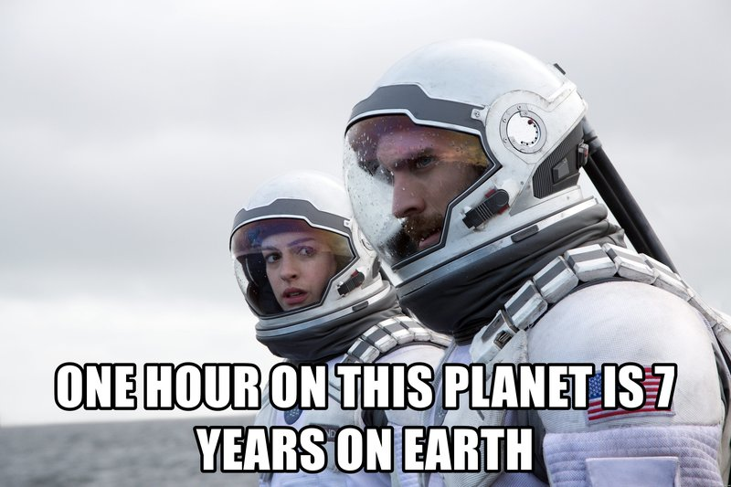
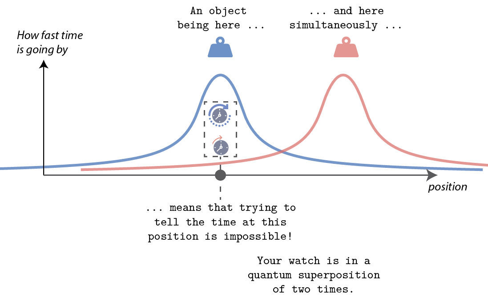

Audience: everyone
------------------

One problem in writing a "theory of everything" which would stem general relativity and quantum mechanics, is that of time.
This is one of the most fundemental problems in physics, and one that I love to talk about.
Through the years, I have refined this explanation through many one-minute party pitches and the motivational slides of scientific presentations.
So.. here it is.

In general relativity, time flows faster or slower depending on how close one is to a heavy object.
This is called time-dilation.
It was famously depicted in the movie "Interstellar". 
Two of the characters go to the "planet with big waves", which is close to a black hole (a really heavy thing).
Because they are close to such a heavy object, time passes really fast for them.
The scene only lasts a few minutes, but when they go back to the spaceship, the guy who stayed behind is years older.

Time-dilation is a confusing concept, but has no major scientific flaws.
The problem comes when we try an mix this concept with quantum mechanics. 
Quantum mechanics tell us that it is possible for an object to be in two places **at the same time**.
We usually study this effect in experiments with small objects, such as atoms.
But there is no proven fundemental reason why this effect should have a size limit.
Except that it is a much bigger technical challenge.
Let's think about what would happen if we put a heavy object in a quantum superposition of being in two places at the same time.
We consider an object that is moved to the left, and to the right, **simultaneously**.

What if you try and measure time close the part of the superposition to the left?
By measuring time I mean that you would bring some kind of clock close to it.
Now your clock is both close to the heavy object, and far away from it.
So in this situation, **time flows in two different ways**.
Being close to the heavy object makes time go faster, and being far away makes time move slower.
It's a real mindbender, but it's theoretically possible.
And no one knows what the consequences would be!

There is no theory which describes a situation in which time is in such a superposition.
But many experimental physicists are trying to make this happen in real life, and measure what happens.
At the same time many theorists are comingn up with different theories which could be proven or disproven by experimentalists.
The fact that this thought experiment is unsolvable with our current laws of physics is undeniable. 
But for example different theories make different proposals as to how heavy an object should be to realize such an experiment.
I will now present such a theory, but beware, it gets a bit/very mathematical.

Audience: physicists
------------------

Let's take our object to be a ball with mass $m$ and radius $R$.
[Solving Einsteins field equations](https://en.wikipedia.org/wiki/Schwarzschild_metric) reveals that the time $t$ measured by a clock at a distance $r$ from the center of the ball is related to the time $t_\text{far}$ measured by a clock infinitely far from the ball through

$$t \simeq t_\text{far}\left(1-\frac{mG}{rc^2}\right)\ ,$$

where $G$ is the gravitational constant, $c$ is the speed of light with the approximations $r>R$, $m\ll Rc^2/G$.
Meaning that if one remains near a heavy object for a while, then returns to a far-away location, people that remained in the far-away location will have aged more.

We now bring quantum mechanics into the picture.
We call the configurations where the ball has been moved to the left or right $\psi_\pm$.
We also assume that these are eigenstates of a hypothetical general-relativistic-Hamiltonian, with eigenenergies $E_\pm = E$.

According to Schrodingers equation, the state of the system would then evolve following 

$$\psi(\ \stackrel{?}{t}\ ) = \psi_+e^{i\stackrel{?}{t}E/\hbar}+\psi_-e^{i\stackrel{?}{t}E/\hbar}\ .$$

Since time has no clear definition, we denoted it by $\stackrel{?}{t}$. 
We can however try and approximate the uncertainty in time $\Delta t$.
Say we are trying to measure time next to the left-displaced part of the superposition, and we collapse the ball into one of the two positions.
If the ball ends up next to our clock, time will be given by
$$t_- \simeq t_\text{far}\left(1-\frac{mG}{rc^2}\right)\ ,$$
if the ball in the right-displaced position, time will be given by $t_+ = t_\text{far}$.
If we estimate the uncertainty in time from the difference of these two quantities, we get

$$\Delta t = t_+-t_- \simeq t_\text{far}\frac{mG}{Rc^2}$$

This would result in an uncertainty in the relative phase of the two parts of this superposition $\Delta\theta = \Delta tE/\hbar$.
Where we recall $E$ is the eigen-energy of the state where the ball is in one position.

Most of our ignorance in determining a gravitational time-scale $t_G$ lies in choosing of a value for $E$.
This absolute energy of the state would usually be a neglected global phase which plays no role in the physics of the system.
Here it sets the time at which general-relativistic effects come into play.
One guess is that that this energy is the relativistic rest-energy of the mass $E = mc^2$.
In this assumption, we arrive at a time-scale for general-relativistic effects

$$t_G = h\frac{R}{m^2G}\ ,$$

defined by $\Delta\theta(t_\text{far}=t_G) = 2\pi$.

Observing such effects would require $t_G$ to be smaller than the coherence time of the system determined by its interaction with the environment.
Note that the time $t_G$ is crucially dependent on the guess $E = mc^2$ which is a very large number.
What will occur at $t_G$ is still up for debate, the fact that an uncertainty in phase seems to emerge from time-dilation points towards decoherence. 
Whilst only experiments can validate or invalidate this guess, it is worth noting that other approaches to this problem have led to a similar estimates of $t_G$.

To give you a sence of scale, if we consider a nano-meter wide ball weighing a nano-gram, the corresponding gravitational time is a nano-second.

References
------------ 
Whilst the heuristic arguments presented here are inspired by Ref.[1], such ideas were first put forth by Karolyhazy [2] and later by Di{\'o}si [3] and then Penrose [4].

[1] Oosterkamp, Tjerk H., and Jan Zaanen. "A clock containing a massive object in a superposition of states; what makes Penrosian wavefunction collapse tick?." arXiv preprint arXiv:1401.0176 (2013).
[2] Karolyhazy, Frederick. "Gravitation and quantum mechanics of macroscopic objects." Il Nuovo Cimento A (1965-1970) 42.2 (1966): 390-402.
[3] Diosi, Lajos. "A universal master equation for the gravitational violation of quantum mechanics." Physics letters A 120.8 (1987): 377-381.
[5] Penrose, Roger. "On gravity's role in quantum state reduction." General relativity and gravitation 28.5 (1996): 581-600.
