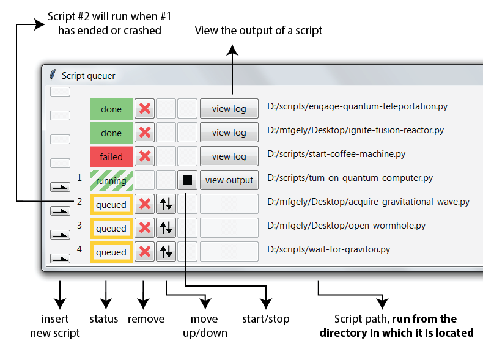

Why would one need a Python script queuer?
------------------------------------------

As with most of my programming projects, I'm really scratching my own itch.
So here's my itch.
I'm an experimental physicists, and all our experiments are controlled by python code.
These experiments are looong. 
An individual measurement could take hours.
All the data for a publication can take months to acquire. 
So it's critical to not lose time such as nights and weekends.


Say you want to run 3 different measurements overnight.
You write a python script which does the three things you need and run it before leaving the lab.
Before going to sleep you quickly check if everything is running smoothly.
The first measurement is ongoing.
But you realize the second one, which is set to start in the night, has some faulty code.
Now you have to interrupt your ongoing measurement to fix the next one, which makes you lose the whole evening of measurement time.

Another problem arises the next morning.
Your overnight measurement has revealed what the perfect next measurement should be.
But you have to keep checking the current measurments progress, waiting for it to end, before starting the next one.

Enter ScriptQ: the Python script queuer
------------------------------------------

ScriptQ is a graphical user interface which allows you to queue python scripts.
After installing it (```pip install scriptq```).
And launching the program (```python -m scriptq```)
you can add a scripts to be run in a given order.


The big advantage is that you can still modify the queued scripts, modify the order in which they should run, or add new scripts, without interrupting the ongoing script.
Hence solving all the fustrating situations mentionned above.


This picture of the interface below should give you an idea of what is possible



As a bonus feature, you can also have scriptq notify you via email when a script ends.
More on that [here](https://github.com/mgely/scriptq#optional-setting-up-email-notifications).

Installation and more
------------------------------------------

To install scriptq, open a terminal and run the command ``pip install scriptq``.

To launch the program run ``python -m scriptq``.

This is an open project accessible on Github [here](https://github.com/mgely/scriptq).